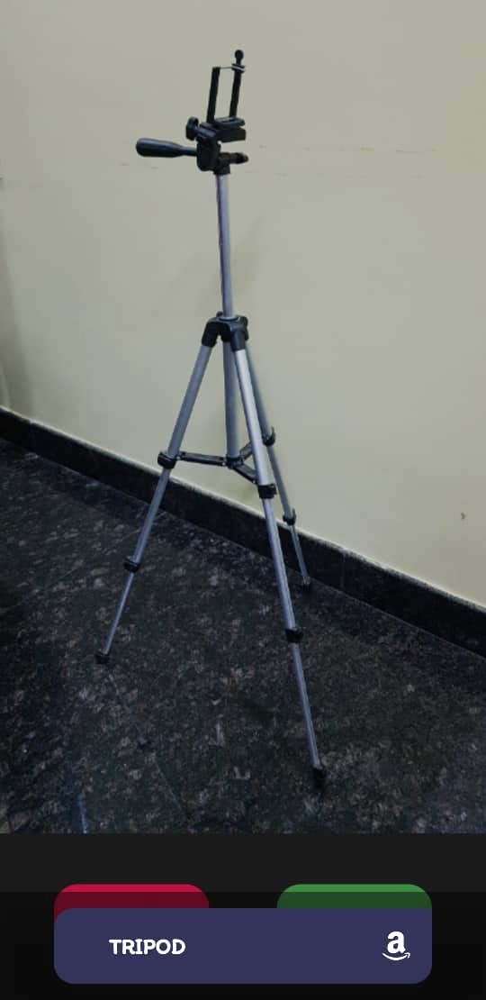

# Image-based Product Recommender
CS300 - Mini Project. A mobile application developed using flutter that takes an image of a product and produces a text-based classification which is then searched on Amazon. A mechanism that collects feedback and stores it, so it can then be used to refine the model at a later stage, is also implemented.

The image classifier model makes its prediction for the product class using a pre-trained ML model available at: “[https://www.tensorflow.org/lite/guide/hosted_models](https://www.tensorflow.org/lite/guide/hosted_models)”. We use the floating point Mobilenet_V2_1.0_224 model from the above link which has been trained over the ImageNet dataset and reports a Top-1 accuracy of 71.8% and a Top-5 accuracy of 90.6% over the same dataset. It is both lightweight taking up only 13.3 MB of space and runs quickly on-device with a good classification accuracy which suits our application use case.

Screenshots showcasing some working examples of product class recommendations made by our application are shown below:

More details along with the Project Report and the Software Implementation Report for this project can be found in the reports folder. Screenshots that showcase the working of our app and some example product recommendations can be found in the screenshots folder.
